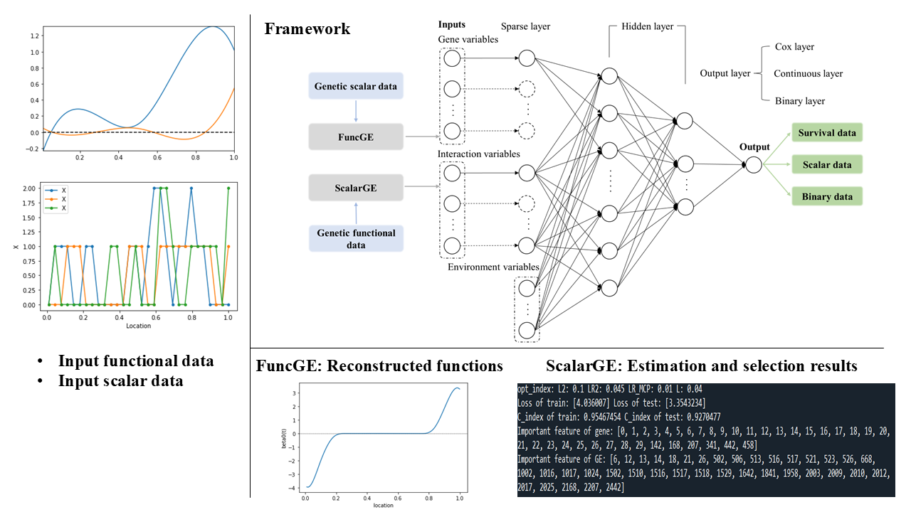

.. GENetLib's documentation documentation master file, created by
   sphinx-quickstart on Thu Oct 31 03:08:37 2024.
   You can adapt this file completely to your liking, but it should at least
   contain the root `toctree` directive.

Welcome to GENetLib's Documentation!
=====================================

**GENetLib** is a Python library for gene–environment interaction analysis via deep learning.
This documentation aims to help users get a comprehensive understanding of our methods, and get started quickly with this package.

In this documentation, you can obtain:

- The introduction and framework of this package

- Details of methods

- Examples for main functions and simulation results

This package has been uploaded to PyPI with previous versions, and the web page is available at
`PyPI package <https://pypi.org/project/genetlib/>`_. 
Users can also check `releases <https://github.com/Barry57/GENetLib/releases>`_  to get historical versions.
Welcome to provide your feedback and make contributions to our package, we will be grateful for all the contributors. 
The ways to contact us are provided in :ref:`contributing to GENetLib <contribution-label>`.

.. toctree::
   :maxdepth: 2

   introduction
   installation
   methods/methods
   main functions/main functions
   simulation
   references
   contribution

