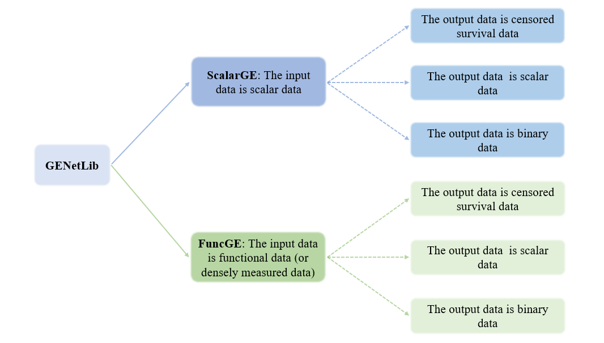

Introduction
==================

.. image:: _static/logo.jpg
   :width: 700
   :align: center

.. image:: https://img.shields.io/pypi/v/GENetLib?logo=Pypi
   :target: https://pypi.org/project/GENetLib
.. image:: https://img.shields.io/badge/Python-3.8%2B-lightblue.svg
.. image:: https://github.com/Barry57/GENetLib/actions/workflows/CI.yml/badge.svg
   :target: https://github.com/Barry57/GENetLib/actions/workflows/CI.yml/badge.svg
.. image:: https://codecov.io/github/Barry57/GENetLib/graph/badge.svg?token=9J9QMN7L9Z
   :target: https://codecov.io/github/Barry57/GENetLib
.. image:: https://img.shields.io/badge/License-MIT-darkgreen.svg
   :target: https://opensource.org/licenses/MIT
.. image:: https://readthedocs.org/projects/genetlib/badge/?version=latest
    :target: https://genetlib.readthedocs.io/en/latest/?badge=latest
.. image:: https://img.shields.io/badge/code%20style-black-000000.svg
   :target: https://github.com/psf/black

**GENetLib** is a Python library designed for gene-environment (G-E) interaction analysis via neural network, 
addressing the analytical challenges in complex disease research.

Package Design
---------------

This package is capable of handling a variety of input data types:

- Scalar input data

- Functional input data (or densely measured data)

When the input data is scalar data, we adopt the :ref:`ScalarGE model<scalarge-label>`. This model is designed to characterize G-E interaction effects between
high-dimensional (scalar) genetic variables and environmental variables. When the input data is functional data or densely measured observations, 
we adopt the :ref:`FuncGE model<funcge-label>`. This model is utilized to capture G-E interaction effects between functional
genetic variables and scalar environmental variables.

To adapt to the multiple output types in clinical analysis, this package supports diverse output requirements:

- Continuous output data

- Binary output data

- Survival output data

By integrating minimax concave penalty (MCP) and L :subscript:`2`-norm regularization within a neural network estimation framework, 
**GENetLib** offers an innovative solution for high-dimensional genetic data analysis. The framework is shown below.

This package has been uploaded to PyPI with previous versions, and the web page is available at
`PyPI package <https://pypi.org/project/genetlib/>`_.  Users can also check `releases <https://github.com/Barry57/GENetLib/releases>`_  to get historical versions.

Features
-----------

**GENetLib** has the following features:

- **Comprehensiveness**: Supports a variety of input and output formats, enabling the construction of comprehensive neural network models for G-E interaction analysis.

- **Flexibility**: Offers a multitude of parameters allowing users to build models flexibly according to their specific needs.

- **Functional data compatibility**: Implements methods for functional data analysis (FDA) in Python, facilitating the processing of functional data with Python.

- **Scalability**: New methods for G-E interaction analysis via deep learning can be easily integrated into the system.