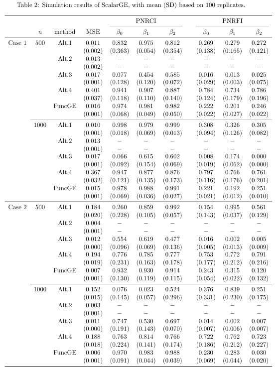
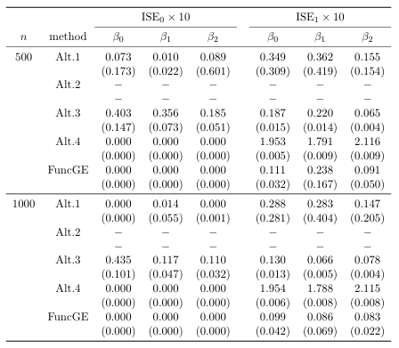
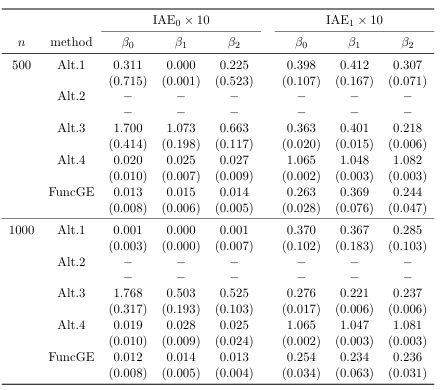

simulation
=========================

.. _simulation-label:

We have conducted simulations on the main methods of the package. 
The simulation settings and basic simulation results can be found in our article. 
Here, we provide additional simulation results, 
including simulations of **the FuncGE model** under different samples and simulation results for the ISE and IAE metrics.

Different samples
------------

We consider sample sizes of 500 and 1000, and the simulation results are presented in the table below.

From the simulation results, we find that the conclusions in our article still hold under different sample sizes.

ISE and IAE
------------

Additionally, to assess the prediction performance of the genetic effect functions \beta_0(t), \beta_1(t), and \beta_2(t) under linear Case 1, we consider another two metrics ISE and IAE. The calculation methods of these metrics are shown below:

.. list-table:: 
   :widths: 40 60
   :header-rows: 1
   :align: center

   * - Parameter
     - Notation
   * - Integrated squared errors on null region (:math:`ISE_0`)
     - :math:`ISE_{0k}=\frac{1}{l_{\mathcal{I}_{0k}}}\int_{\mathcal{I}_{0}} (\hat{\beta}_{k}(t) - \beta_{k}(t))^{2} dt` where :math:`l_{\mathcal{I}_{0k}}` is the length of null region :math:`\mathcal{I}_{k}` of :math:`\beta_{k}(t)`
   * - Integrated squared errors on nonnull region (:math:`ISE_1`)
     - :math:`ISE_{1k}=\frac1{l_{\mathcal{I}_{1k}^c}}\int_{\mathcal{I}_1^c}(\hat{\beta}_k(t)-\beta_k(t))^2dt` where :math:`l_{\mathcal{I}_{1k}^c}` is the length of nonnull region :math:`\mathcal{I}_k^c` of :math:`\beta_k(t)`
   * - Integrated absolute errors on null region (:math:`IAE_0`)
     - :math:`ISE_{0k}=\frac{1}{l_{\mathcal{I}_{0k}}}\int_{\mathcal{I}_{0}} |\hat{\beta}_{k}(t) - \beta_{k}(t)| dt` where :math:`l_{\mathcal{I}_{0k}}` is the length of null region :math:`\mathcal{I}_{k}` of :math:`\beta_{k}(t)`
   * - Integrated absolute errors on null region(:math:`IAE_1`)
     - :math:`ISE_{1k}=\frac1{l_{\mathcal{I}_{1k}^c}}\int_{\mathcal{I}_1^c}|\hat{\beta}_k(t)-\beta_k(t)|dt` where :math:`l_{\mathcal{I}_{1k}^c}` is the length of nonnull region :math:`\mathcal{I}_k^c` of :math:`\beta_k(t)`

Notably, under nonlinear Case 2, we focus exclusively on prediction performance using MSE, without considering ISE or IAE. Due to the functional form of g, the network output may produce :math:`-\beta_k(t)` instead of :math:`\beta_k(t)`, :math:`k=0,1,2`, because of the network's insensitivity to the sign of the sparse layer and first hidden layer weights.

The simulation results are presented in the table below.

The simulation results display FuncGE's predictive accuracy in estimating main and interaction effect functions, as measured by the integrated squared error and integrated absolute error metrics, where lower error values indicate better performance.
